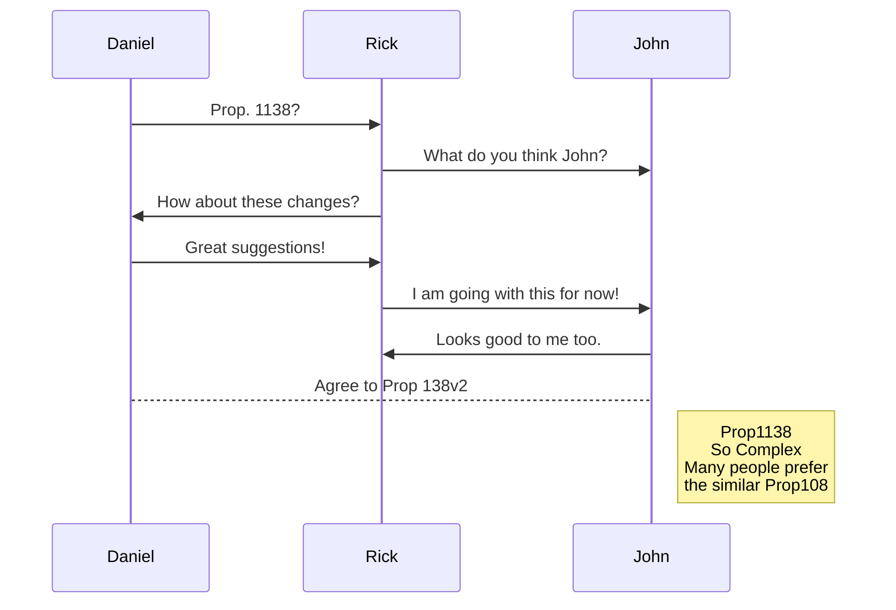
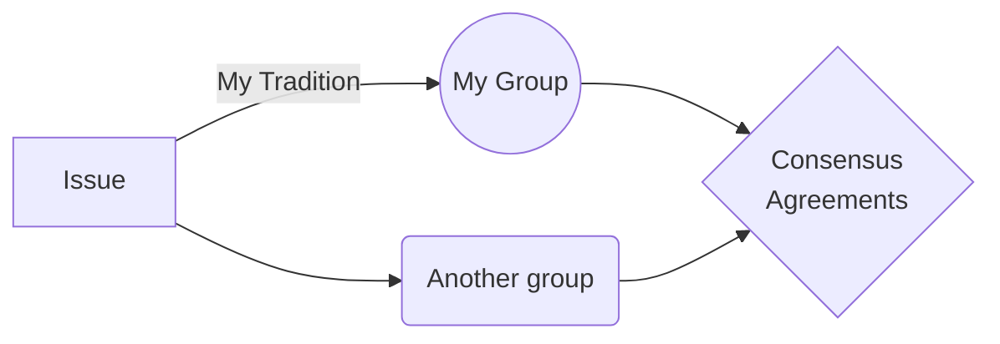

# The People's Tea Party

Welcome to **The People's Tea Party**. 
If you came to learn about The People's Tea Party, you are in the right place. 
If you want to participate we will be excited to meet you!

# Platform Ethics
**Liberty**
**Mutual Interdependence**
**Cooperation**
**Pragmatics**
**Democracy**


## Liberty

All about that. Fill in later.

## Mutual Interdependence

All about that. Fill in later.

## Cooperation

All about that. Fill in later.

## Pragmatics

All about that. Fill in later.

## Democracy

All about that. Fill in later.


# Authority

**Authority** comes from intersubjective agreement.

- Be a lamp unto your self.
	> You can write your own code, or you can copy mine. Use Git.

- **Ethics**, **Authority**, and **Agreements**.
	> This is just a template for starting to think about inter-subjective framing on a system of legal **Version Control**. 
	What other issues must be discussed?


# Agreements

So far we have no agreements.

> In the future there will be a link here to propositions.

## Propositions

More on that later.

## Amendments

Right now everyone should keep their own Git. 
No need for formal Amendments until there is a formal repository of agreements.

> **Note:** The **Future** has not been published yet.

## Hierarchy

Until there is a formal repo there needs to be no hierarchy.

> **Incorporate** the **Best Ideas** from **Anyone** </br>
> *"Best" is a Subjective Evaluation*.


## Democracy and Liberty

Sometimes we have to do things we would rather not do because it seems to be in our vital self interest. When this is the case we firmly believe in `Due Process`
For example:

|    |Problem            |Process      |
|----|-----------------|---------------|
|Taxes | Consent to be ruled     |`Accountability`  |
|Inequality | Fortune is provisional and idiosyncratic.    |`Democratic Social Wellfare`   |
|Restorative Justice  |   |` `|


## Git Up for Version Control



 
### We don't have to agree on everything:


# About the Theme:

<h1 align="center">
  <br>
  
  <br>
</h1>

Reverie is a [Jekyll](https://jekyllrb.com/)-powered theme which is simple and opinionated. It's actually a fork of [jekyll-now](https://github.com/barryclark/jekyll-now) with some additional features and [personal touches](https://github.com/amitmerchant1990/amitmerchant1990.github.io) which I've implemented to suit my needs for [my blog](https://www.amitmerchant.com).

> [Theme demo](https://www.amitmerchant.com/reverie/introducing-reverie-jekyll-theme/)

This is a plug-and-play Jekyll theme which you can use on GitHub Pages without even setting up a local environment.


## Features

- Command-line free fork-first workflow, using GitHub.com to create, customize and post to your blog
- Fully responsive and mobile optimized base theme (Theme Demo)
- Sass/Coffeescript support using Jekyll 2.0
- Free hosting on your GitHub Pages user site
- Markdown blogging
- Elegant typography
  - Futura PT fonts (The same fonts which has been used on <https://pixar.com>)
- Syntax highlighting using Pygments
    - [Dracula syntax theme](https://draculatheme.com/) included
- Disqus commenting
- Google Analytics integration
- Categorize posts out-of-the box
- A home widget to show recent GitHub commit
- RSS Feed

## Using Reverie on GitHub Pages

### Step 1) Fork Reverie to your User Repository

Fork this repo, then rename the repository to `yourgithubusername.github.io`.

Your Jekyll blog will often be viewable immediately at <https://yourgithubusername.github.io> (if it's not, you can often force it to build by completing step 2)

### Step 2) Customize and view your site

Enter your site name, description, avatar and many other options by editing the `_config.yml` file. You can easily turn on Google Analytics tracking, Disqus commenting and social icons here.

Making a change to `_config.yml` (or any file in your repository) will force GitHub Pages to rebuild your site with jekyll. Your rebuilt site will be viewable a few seconds later at <https://yourgithubusername.github.io> - if not, give it ten minutes as GitHub suggests and it'll appear soon.

### Step 3) Publish your first blog post

Create a new file called `/_posts/2019-2-13-Hello-World.md` to publish your first blog post. That's all you need to do to publish your first blog post! This [Markdown Cheatsheet](https://github.com/adam-p/markdown-here/wiki/Markdown-Cheatsheet) might come in handy while writing the posts.

> You can add additional posts in the browser on GitHub.com too! Just hit the <kbd>Create new file</kbd> button in `/_posts/` to create new content. Just make sure to include the [front-matter](http://jekyllrb.com/docs/frontmatter/) block at the top of each new blog post and make sure the post's filename is in this format: year-month-day-title.md

## Using Categories in Reverie

You can categorize your content based on `categories` in Reverie. For this, you just need to add `categories` in front matter like below:

For adding single category:

```md
categories: JavaScript
```

For adding multiple categories:

```md
categories: [PHP, Laravel]
```

The contegorized content can be shown over this URL: <https://yourgithubusername.github.io/categories/>

## RSS

The generated [RSS feed](https://en.wikipedia.org/wiki/RSS) of your blog can be found at <https://yourgithubusername.github.io/feed>. You can see the example RSS feed over [here](https://www.amitmerchant.com/feed).

## Sitemap

The generated sitemap of your blog can be found at <https://yourgithubusername.github.io/sitemap>.

## The name?

reverie - _a state of being pleasantly lost in one's thoughts; a daydream._<br><sup>/ˈrɛv(ə)ri/</sup> 


## License

MIT
