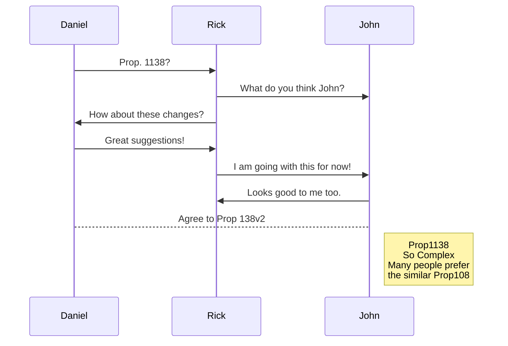
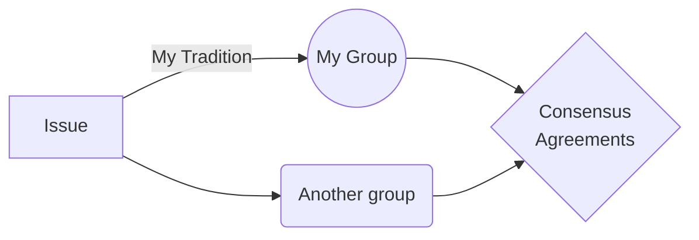

# The People's Tea Party

Welcome to **The People's Tea Party**. 
If you want to participate we will be excited to meet you!

# Platform Ethics
**Liberty** - 
**Mutual Interdependence** - 
**Cooperation** - 
**Pragmatics** - 
**Democracy** 

## Liberty

All about that. Fill in later.

## Mutual Interdependence

All about that. Fill in later.

## Cooperation

All about that. Fill in later.

## Pragmatics

All about that. Fill in later.

## Democracy

All about that. Fill in later.

# Authority

**Authority** comes from intersubjective agreement.

- Be a lamp unto your self.
	> You can write your own code, or you can copy mine. Use Git.
- **Ethics**, **Authority**, and **Agreements**.
	> This is just a template for starting to think about inter-subjective framing on a system of legal **Version Control**. 
	What other issues must be discussed?

# Agreements

So far we have no agreements.

> In the future there will be a link here to propositions.
## Propositions

More on that later.

## Amendments

Right now everyone should keep their own Git. 
No need for formal Amendments until there is a formal repository of agreements.

> **Note:** The **Future** has not been published yet.
## Hierarchy

Until there is a formal repo there needs to be no hierarchy.

> **Incorporate** the **Best Ideas** from **Anyone**  
> *"Best" is a Subjective Evaluation*.

## Democracy and Liberty

Sometimes we have to do things we would rather not do because it seems to be in our vital self interest. When this is the case we firmly believe in `Due Process`
For example:

|    |Problem            |Process      |
|----|-----------------|---------------|
|Taxes | Consent to be ruled     |`Accountability`  |
|Inequality | Fortune is provisional and idiosyncratic.    |`Democratic Social Wellfare`   |
|Restorative Justice  |   |` `|

## Git Up for Version Control

### We don't have to agree on everything:

